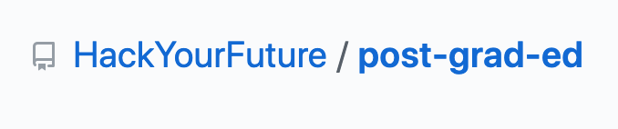
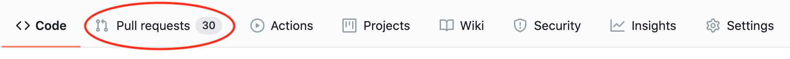
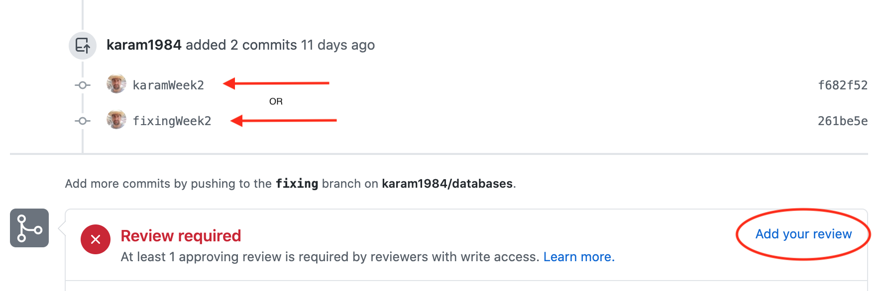

# How to perform a code review

Being able to perform a code review is an essential skill for a developer. In this tutorial you'll learn how to perform a code review on GitHub to give your classmate valuable feedback.

### Where to start

Before we start the code review, we have to know where do it. Follow the steps:

1. Go to the repository that contains the pull requests you want to review. In our case that's [/hackyourfuture/post-grad-ed](https://github.com/hackyourfuture/post-grad-ed/):



2. Click on the "Pull requests" tab:



3. Click on the pull request you want to review:


4. You can start a review in one of two ways: by clicking on a specific commit or the "add your review" button:



5. You can add comments to individual lines (by clicking the line number, as seen on the left) or the whole commit as a whole (by clicking the green "Review changes" button):


### How to review code

To review code it's important to have 2 things: right mindset and knowing what to look for.

The right mindset to have is: how can my comments help everyone learn?

- [Bringing A Healthy Code Review Mindset To Your Team](https://www.smashingmagazine.com/2019/06/bringing-healthy-code-review-mindset/)

Know what to look for. The follow list contains aspects of the code you should focus and comment on:

- Coding style
- Correct syntax
- Formatting
- Consistency

- [How to Review Someone Else's Code](https://www.youtube.com/watch?v=TlXy_i27N3w)

When providing feedback you don't want to be harsh or unhelpful/

```md
# BAD EXAMPLES

- Dude, that code sucks
- Why would you ever want to do that?
- This makes no sense
```

Instead you want to to be **constructive** and **helpful**. Take a look at the following examples:

```md
# GOOD EXAMPLES

- It seems like you misspelled something here. Is that correct?
- A simpler way of doing this could be to use the `map()` function. What do you think?
- This code looks clean and simple. Good job man!
```

If there's anything still unclear, regarding doing code review, do your own research. Also, reach out to your mentor for any questions you might have.

Good luck with reviewing code!
